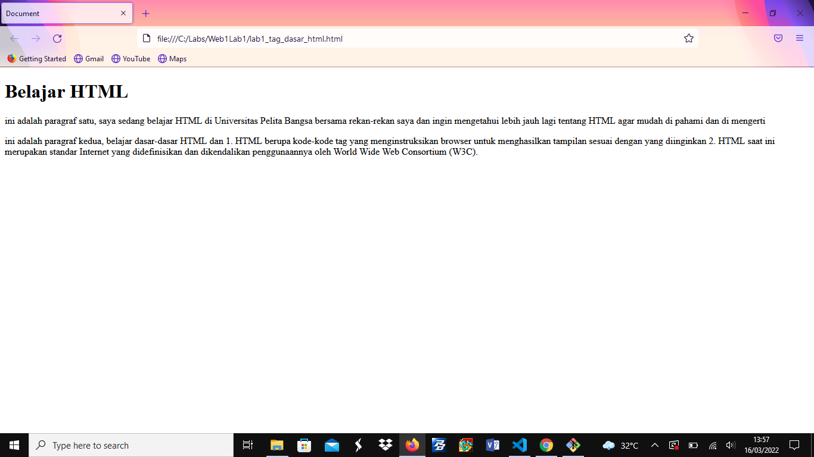

# Web1Lab1
### Praktikum 1: HTML Dasar

## Tujuan
1.	Mahasiswa mampu memahami struktur dasar HTML
2.	Mahasiswa mampu memahami Tag-tag dasar HTML
3.	Mahasiswa mampu membuat dokumen HTML

## Pengantar HTML
HTML (Hypertest Markup Language) merupakan bahasa markup yang digunakan untuk membuat sebuah halaman web dan menampilkan berbagai informasi di dalam sebuah browser. HTML  berupa kode-kode tag yang menginstruksikan browser untuk menghasilkan tampilan sesuai dengan yang diinginkan. HTML saat ini merupakan standar Internet yang didefinisikan dan dikendalikan penggunaannya oleh World Wide Web Consortium (W3C).
HTML memiliki struktur yang fleksibel, tanpa lojik serta toleran terhadap kesalahan. Standar minimal dari dokumen HTML terdiri dari:
•	Document Type Declaration (DTD)
•	Document Header
•	Document Body

<!DOCTYPE  html>
<html>
<head>
...  deklarasi  header  ...
</head>
<body>
...  Isi  dokumen  ...
</body>
</html>

## Tag HTML
Tag adalah sebauh penanda awalan dan akhiran dari sebuah elemen di HTML. Tag dibuat dengan kurung siku (<...>), lalu di dalamnya berisi nama tag dan kadang juga ditambahkan dengan atribut.
Contoh: 
, <a>, <body>, <head>, dan sebagainya.
Tag selalu ditulis berpasangan. Ada tag pembuka dan ada tag penutupnya. Namun, ada juga beberapa tag yang tidak memiliki pasangan penutup.
Contoh:  ,  
,  <input/>,  , dan sebagainya.

Ini contoh tampilan Praktikum Pemrograman Web :

contoh tampilan praktikum lainnya :

! [img2](screenshot/s2.png)

## Sekian dari saya terima kasih